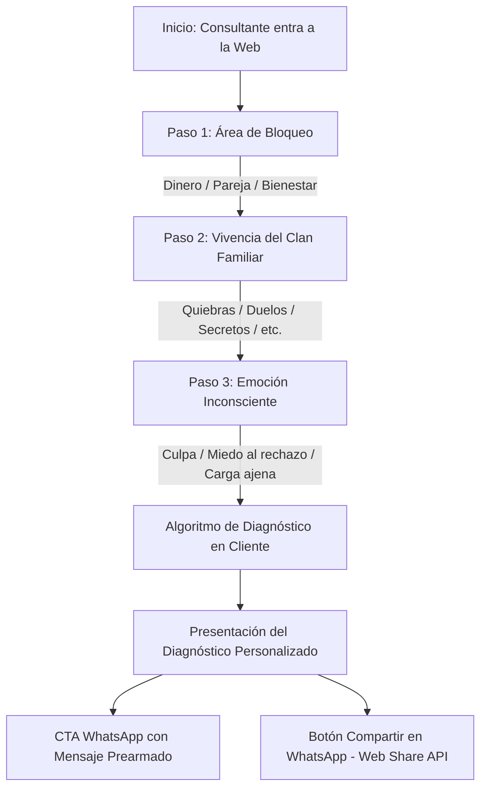

# ESPECIFICACIONES TÉCNICAS Y ARQUITECTURA (CÉSAR RUEDA WEB)
> **Stack:** HTML5 Semántico, CSS3 Moderno (Custom Properties & Flex/Grid), JavaScript Vanilla (ES6+), PWA  
> **Patrón:** Single-Page Architecture (SPA) / Single-File Resilient Distribution  
> **Estándares:** WCAG 2.1 AA, Mobile-First, Core Web Vitals (LCP < 2.5s, CLS = 0), Zero-PII  

---

## 1. 🏗️ ESTRUCTURA DE CÓDIGO Y DISTRIBUCIÓN RESILIENTE

El proyecto está diseñado bajo el principio de **Autocontención y Resiliencia**:
* **[`index.html`](file:///c:/Proyectos/cesar-rueda/index.html):** Contiene la estructura completa, estilos embebidos y scripts de interactividad. Esto permite que el archivo sea transportable, se pueda previsualizar localmente o desplegar en cualquier CDN (Netlify Drop, Firebase Hosting, Cloudflare Pages, GitHub Pages) sin pasos de compilación (`npm build`) ni dependencias frágiles.
* **Foto Profesional en Base64:** La imagen de César Rueda (`cesar-rueda.jpg`) está codificada en Base64 en el marcado HTML principal, garantizando que nunca aparezca una imagen rota en móviles con mala conexión.
* **Fotografía Externa para OpenGraph:** La imagen física `cesar-rueda.jpg` se aloja en la raíz para que los crawlers de redes sociales (WhatsApp, Facebook, Twitter, iMessage) puedan extraerla directamente en las tarjetas de previsualización (`og:image`).

---

## 2. 📱 DISEÑO MOBILE-FIRST Y ERGONOMÍA TÁCTIL

Dado que más del **85% al 90% del tráfico** proviene de smartphones tras interactuar con videos en Instagram y TikTok:
1. **Sticky Bottom Action Bar:** 
   * Barra fija en la parte inferior de la pantalla para dispositivos `<= 768px`.
   * Pone al alcance natural del pulgar los dos llamados a la acción primarios: *Iniciar Test* y *WhatsApp Directo*.
2. **Soporte de Safe Area Insets:**
   * Regla CSS: `padding-bottom: calc(10px + env(safe-area-inset-bottom));`
   * Previene que la barra flotante solape la barra de navegación gestual de iOS (iPhone) o Android.
3. **Touch Targets de Alta Precisión:**
   * Todos los botones interactivos poseen una altura mínima de **48px a 52px**.
   * Feedback táctil mediante micro-interacción `:active { transform: scale(0.97); }`.

---

## 3. 🧠 EL ESCÁNER DE LEALTADES INCONSCIENTES (LEAD MAGNET)

El escáner interactivo es el núcleo de conversión de la web. Opera en un flujo guiado de 3 pasos:



### Lógica de Procesamiento y Variables:
* **Paso 1 (`q1`):** `dinero` | `relaciones` | `bienestar`
* **Paso 2 (`q2`):** Vivencia predominante del clan familiar (ej. quiebras, lealtad a la carencia, rupturas cíclicas, enfermedades o secretos).
* **Paso 3 (`q3`):** Sensación inconsciente interna (ej. miedo a perder pertenencia, culpa por ganar más que los padres, sensación de cargar una mochila ajena).
* **Salida Dinámica:**
  * Genera una explicación psicológica empática del bloqueo.
  * Inyecta la recomendación terapéutica de César Rueda.
  * Modifica el enlace de WhatsApp con el texto exacto codificado (`encodeURIComponent`).

---

## 4. 🔒 BLINDAJE LEGAL Y PRIVACIDAD ZERO-PII

Cumplimiento estricto con la **LFPDPPP (México)** y el **RGPD (Unión Europea)** (ADR-002):
1. **Cero Almacenamiento Invasivo:** El cuestionario no solicita nombres, correos ni teléfonos en la web.
2. **Ejecución 100% en Navegador (Client-Side):** Ninguna respuesta se envía a bases de datos remotas ni servidores de tracking de terceros.
3. **Modal de Aviso de Privacidad:** Accesible desde el footer con navegación por teclado (`Escape` para cerrar, trampa de foco y bloqueo de scroll `overflow: hidden`).
4. **Traspaso Voluntario:** El usuario solo comparte sus respuestas si decide voluntariamente presionar el botón de WhatsApp para contactar a César.

---

## 5. 🔍 SEO SEMÁNTICO Y OPTIMIZACIÓN GEO

### Schema.org JSON-LD Estandarizado:
* **Entidad `ProfessionalService`:**
  * `name`: César Rueda — Desprogramación Evolutiva
  * `currenciesAccepted`: `"MXN, USD, EUR"`
  * `telephone`: `"+52 55 7433 3257"`
  * `url`: `"https://cesar-rueda-draft.netlify.app/"`
  * `openingHoursSpecification`: Modalidad online global.
* **Entidad `FAQPage`:**
  * Incluye 6 preguntas frecuentes estructuradas para obtener acordeones desplegables enriquecidos (Rich Snippets) en las búsquedas móviles de Google.

### Bloque Answer-First para Motores de IA (GEO):
* Ubicado en la sección de Metodología dentro del contenedor `.geo-answer-card`.
* Texto optimizado de 45 palabras con alta densidad de palabras clave directas para ser citado en **Google AI Overviews** y **Perplexity AI**.

---

## 6. ♿ ACCESIBILIDAD WEB (WCAG 2.1 AA)

* **Etiquetas ARIA:** Botones con iconos usan `aria-label="Hablar con César Rueda por WhatsApp"` y `role="button"`.
* **Acordeón FAQ Accesible:** Cada elemento utiliza `role="region"`, `aria-expanded="true/false"`, `tabindex="0"` y responde tanto al clic como a las teclas `Enter` y `Espacio`.
* **Contraste de Color:** Paleta validada con contraste superior a 4.5:1 sobre fondo claro.

---

## 7. 🧪 SUITE DE VERIFICACIÓN AUTOMATIZADA (`verify_draft.py`)

Para garantizar que ningún cambio rompa los estándares de calidad, se ejecuta localmente:
```bash
python verify_draft.py
```
El script realiza 8 validaciones automatizadas:
1. Validez sintáctica del bloque Schema.org JSON-LD.
2. Presencia de `ProfessionalService` con monedas `EUR`, `MXN`, `USD`.
3. Presencia de `FAQPage` estructurada.
4. Canonical URL apuntando al dominio de producción.
5. Metadatos OpenGraph con la imagen oficial de César.
6. Modal de privacidad Zero-PII (LFPDPPP y RGPD).
7. Bloque GEO Answer-First para motores de búsqueda de IA.
8. Verificación de respuesta HTTP `200 OK` en el despliegue en vivo en Netlify.
